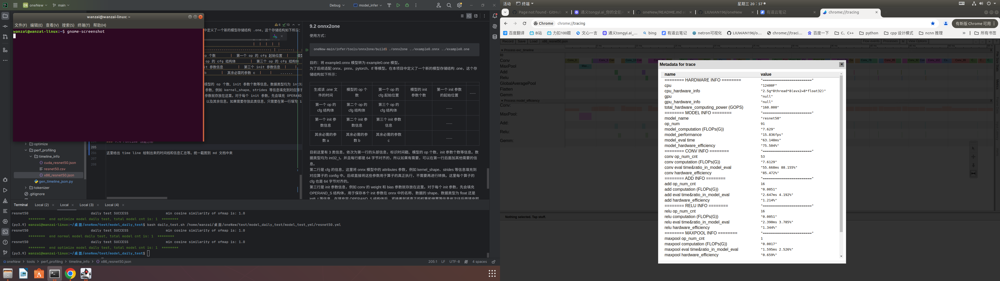

# oneNew

## 一、本项目作用是什么  
包括：  
1、模型的转换：ONNX --> one  
2、模型优化：  
    算子融合，例如 conv + act、layer norm、GELU 等；  
    量化，支持 kl、mse 等量化方法；  
    目标硬件参数寻优  
3、运行时实时构建计算图，进行推理  
4、后端支持 x86 和 cuda 两种实现，目前已经支持约 50 个算子  
5、目前已支持大量模型的推理部署，例如：  
5.1、cnn 模型：  
    a)、分类：inception_v3、mobilenet_v2、resnet18、resnet50、se net50 .etc  
    b)、目标检测：yolov3、yolov5s、yolov7、yolov8s、yolov10s .etc  
    c)、分割：yolov8n_seg  .etc  
    d)、姿态识别：yolov8m_pose  
5.2、vit 模型：  
    a)、分类：mobilevit_s、swin_t、vit_t .etc  
    b)、目标检测：rt_detr  
5.3、多模态：  
    a)、图文互搜：CLIP  
    b)、目标检测：yolo_world  
    c)、分割：mobile_sam  

6、支持从 onnx parse 新算子进行适配，支持自定义算子，支持自定义融合算子  
7、支持使用 onnx runtime 来对 one new 结果逐层比较相似度  
8、支持使用 Google 的 tracing 工具绘制 time line，拿到每个 layer 的耗时长短，计算量，硬件利用率。方便快速定位性能瓶颈，进行优化  


## 二、常见网络的 benchmark  
这里填入 cpu 和 cuda 的性能。cpu 给出单线程和8个线程的性能。另外cuda可以先说明支持情况不太完善。

|          |                    |               |              |              |                      |
|:--------:|:------------------:|:-------------:|:------------:|:------------:|:--------------------:|
| 模型类型  |        模型名称        |  计算量 (GPlos)  | x86 单线程fps | x86 八线程fps | cuda （GTX 960）fps |  
| classify |      resnet18      |        7.7    |      5       |      15      |         4.2          |
| classify |      resnet50      |        7.7    |      5       |      15      |         4.2          |
| classify |    mobilenet v2    |        7.7    |      5       |      15      |         4.2          |
| classify | mobilenet v3 large |        7.7    |      5       |      15      |         4.2          |


## 三、下载方式及代码结构  
### 3.1 代码下载  
网址：https://github.com/LIUWAN196/oneNew  
拉代码：git clone https://github.com/LIUWAN196/oneNew.git
### 3.2 目录结构  
```shell {.line-numbers}
oneNew
├── CMakeLists.txt
├── common
│   ├── log.h
│   ├── nn_common.h
│   ├── utils_c.h
│   └── utils_cpp.hpp
├── device
│   ├── cuda
│   ├── x86
│   └── x86_utils
├── example
│   ├── CLIP_model.h
│   ├── CMakeLists.txt
│   ├── MobileSAM_model.h
│   ├── model_infer.cpp
│   ├── Normal_model.h
│   └── post_process.hpp
├── host
│   ├── manager
│   ├── net.h
│   ├── op.h
│   ├── ops
│   └── ops_head.h
├── imgs
│   └── src_img
├── model_and_cfg_zoo
│   └── configs
├── README.md
├── test
│   ├── model_daily_test
│   ├── model_self_test_with_ort
│   ├── op_self_test
│   ├── show_seg_pose_result
│   └── test_clip_model.py
└── tools
    ├── metrics
    ├── onnx2one
    ├── optimize
    ├── perf_profiling
    └── tokenizer
```
## 四、代码编译  
### 4.1 编译 debug 版本  
```shell {.line-numbers}
mkdir a_dbg_build
cd a_dbg_build
cmake ..
make
```
debug 版本没有任何优化，并支持断点调试

### 4.2 编译 release 版本
```shell {.line-numbers}
mkdir a_rls_build
cd a_rls_build
cmake .. -DCMAKE_BUILD_TYPE=Release
make
```
release 版本采用 O3 优化，不支持断点调试

### 4.3 编译最佳性能版本
```shell {.line-numbers}
mkdir a_final_build
cd a_final_build
cmake .. -DCMAKE_BUILD_TYPE=Release -DLOG_LEV=0
make
```
即代码模型确定无误后，使用 release 编译，并完全关闭日志信息，以获取最佳性能
### 4.4 日志等级  
debug 版本的日志等级默认为：-DLOG_LEV=2，即 DBG_LEVEL  
release 版本的日志等级默认为：-DLOG_LEV=1，即 ERR_LEVEL  
如果想编译日志等级，可以在：cmake .. 中配置 -DLOG_LEV=<0,1,2,3>  
其中 =3 表示 MSG 等级的日志，有更多信息展示；=0 表示完全关闭日志信息，连 ERR 等级的日志都不会打印，建议只有在完全确定代码和模型无误的情况下，使用 -DLOG_LEV=0

## 五、模型下载并运行  
### 5.1 下载模型及配置文件  
从百度网盘下载，百度网盘如下：  
推荐第一次使用，先下载 one 模型 (在 oneNew 项目中直接运行的模型)，也可以下载 onnx 模型，然后使用下面的模型转换工具 onnx2one 转为 one 模型使用  

### 5.2 运行模型  
以 resnet50 模型为例，将下载得到的 resnet50.one 的存放路径，放置到 rt_resnet50.yml 的 one_file_path 中    
显示结果如下图所示，即表明运行正确。  
图 1  

以 yplov5s 模型为例，将下载得到的 yolov5s.one 的存放路径，放置到 rt_yolov5s.yml 的 one_file_path 中  
显示结果如下图所示，即表明运行正确。  
图 2 

## 六、CLIP 和 MobileSAM 模型下载并运行
### 6.1 下载 one 模型及配置文件  
从百度网盘下载，百度网盘如下：

### 6.2 运行模型  
CLIP 显示结果如下图所示，即表明运行正确。  
图 3  

MobileSAM 显示结果如下图所示，即表明运行正确。  
图 4 

## 七、新增模型适配步骤
### 7.1 模型转换
参考 9.2 节，将 onnx 转为 one 格式的模型，并且查看是否有 LOG ERR 报错，一般是查看是否有不支持的算子

### 7.2 用户新增自定义算子
**增加 config；增加 host 侧的类管理和算子注册；增加 dev 侧的 forward 实现**

### 7.3 适配新的模型
在完成 8 算子新增后，自动完成新模型的适配
### 7.4 调试模型正确性
参考 8.2 节，使用 ofmap dump 模式。把 onnxruntime 拿来对照，看哪个节点卡住或者相似度低
### 7.5 性能调优
参考 9.4 节，结果正确后，使用性能模式，dump 出每个 layer 的性能数据，看哪类 op 或者哪个 layer 利用率较低，进行优化
参考 9.3 节，如果有需要，通过 optimize 来量化模型或者做算子融合
### 7.6 添加后处理
性能优化结束后，为模型增加有必要的后处理（例如分类，目标识别等）
### 7.7 将模型加入集成测试
参考 8.1 节将模型加入 ci 测试
### 7.8 完成新模型的适配工作

## 八、test 工具说明  
### 8.1 多模型集成测试

### 8.2 单模型逐层自测


## 九、tools 工具说明  
### 9.1 精度测试


### 9.2 onnx2one  
使用方式：  
```shell {.line-numbers}
oneNew-main/infer/tools/onnx2one/build$ ./onnx2one ../example0.onnx ../example0.one
```
目的：将 example0.onnx 模型转为 example0.one 模型。  
为了后续适配 onnx、pnnx、pytorch、tf 等模型。在本项目中定义了一个新的模型存储结构 .one，这个存储结构如下所示：  

|                      |                                             |  |  |  |  |
| :------------------------: | :---------------------------------------------: | :------: | :------: | :------: | :------: |
|      生成该 .one 文件的时间      |      模型的 op 个数       |  第一个 op 的 cfg 起始位置  |    模型的 init 参数个数     |    第一个 init 参数的起始位置     |    ......     |  
|      第一个 op 的 cfg 结构体      |      第二个 op 的 cfg 结构体       |  第三个 op 的 cfg 结构体  |    |    ......     |  
|      第一个 init 参数信息      |      第二个 init 参数信息       |  第三个 init 参数信息  |    |    ......     |   
|      其余必需的参数 a      |      其余必需的参数 b       |  其余必需的参数 c  |    |    ......     |  

目前这里有 3 类信息，依次为第一行的头部信息，标识时间戳、模型的 op 个数、init 参数个数等信息。数据类型均为 int32_t。并且每行都是 64 字节对齐的，所以如果有需要，可以在第一行后面加其他需要的信息。  
第二行是 cfg 的信息，这里将 onnx 模型中的 attributes 参数，例如 kernel_shape、strides 等信息填充到对应算子的 config 中。后续直接将这些参数用于算子的真正执行，不需要再进行转换。这里每个算子的 cfg 也是 64 字节对齐的。  
第三行是 init 参数信息，例如 conv 的 weight 和 bias 参数就存放在这里。对于每个 init 参数，先会填充 OPERAND_S 结构体，用于保存本个 init 参数在 onnx 中的名称、数据的 shape、数据类型为 float 还是 int8_t 等信息，在填充完 OPERAND_S 结构体后，紧接着就将真正的权重和偏置等信息依次往后面填充即可。同理这里每个 init 参数也是 64 字节对齐的。  
第四、五、六、... 行：备用，可以用来存放 input、output 以及其余信息。如果需要存放此类信息，只需要在第一行填写 input/output 个数，在 one 这个文件中存放的起始偏移位置，即可在第四行添加对应信息即可。

### 9.3 模型优化
**算子融合**  
**模型量化**  
**性能自动调优**  

### 9.4 runtime 性能分析

这里给出 time line 绘制出来的时间线和信息汇总等。统一截图到 md 文档中来

