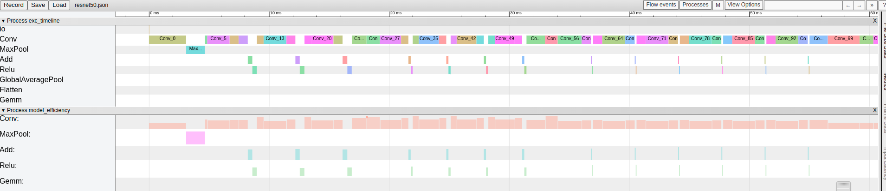

# oneNew

## 一、项目概述  
一款轻量化的推理部署框架，项目结构简单、易懂。目前已支持包括图文互搜模型 CLIP、开发式轻量化分割模型 mobileSAM 等大量模型的推理部署。

项目主要包括：  
1、自定义一种中间表示：one，并支持ONNX ----> one的**模型转换**  
2、模型优化：  
------>**算子融合**：例如 conv + act、layer norm、GELU 等；  
------>**模型量化**：支持 kl、mse 等量化方法；  
------>**性能调优**：支持在目标硬件上对参数进行寻优 (目前只支持网格法)  
3、在运行时，构建计算图，实现 runtime 对后端算子的依次调用进行推理  
4、支持 x86 和 cuda 两种实现。x86 已支持约 50 个算子，cuda 算子支持较少，还在支持中  
5、目前已支持大量模型的推理部署，例如：  
------>5.1、**CNN 模型**：a)、分类：mobilenet 系列、resnet 系列、inception_v3 等；b)、目标检测：yolo v3 ~ v10 系列；c)、分割：yolo v8 seg 等； d)、姿态识别：yolov8 pose 等；  
------>5.2、**ViT 模型**：a)、分类：mobilevit_s、swin_t、ViT 等；b)、目标检测：rt_detr 等；  
------>5.3、**多模态**：a)、图文互搜模型 CLIP；b)、开放目标检测模型 yolo_world；c)、轻量化开放分割模型 mobile_sam。   
6、支持使用 onnx runtime 生成 golden data，对 one 模型逐层进行数据相似度对比  
7、**支持性能分析**: 使用 Google 的 tracing 工具绘制 time line，拿到每个 layer 的耗时、计算量、硬件利用率等信息。方便快速定位性能瓶颈，进行优化  
8、支持对适配完成的模型进行**集成测试**。

## 二、常见网络 benchmark  
为方便用户直观感受 oneNew 推理框架的实用效果，给出常用模型的 cpu 实测性能数据：  
|            |                    |               |              |              |                      |
|:----------:|:------------------:|:-------------:|:------------:|:------------:|:--------------------:|
| model name |   model type  | single thread (ms) | 8 thread (ms) | NCNN (ms)  | ONNX Runtime (ms) |
| mobilenet_v2 |      classify      |   23.3        |    10.4        |          |               |
| resnet18 |      classify      |    96.8      |     32.8       |           |                 |
| resnet50 |      classify      |   201.1       |    63.6        |           |                 |
| inception_v3 |      classify      |    286.7      |   110.8         |           |                 |
| swin_t |      classify      |    744.1      |    359.5        |           |                 |
| vit_t |      classify      |    61.0      |    34.1        |           |                 |
|        |        |        |        |        |        |
| yolov3 |      object detect      |    3151.4      |   1054.2         |           |                 |
| yolov5s |      object detect      |   420.9       |   166.4         |           |                 |
| yolov8s |      object detect      |    671.9      |    244.7      |           |                 |
| yolov10s |      object detect      |    539.5      |    217.4          |           |                 |
| rt detr |      object detect      |   2413.0       |   1023.3         |           |                 |
|        |        |        |        |        |        |
| yolov8m seg |      segment detect      |    3439.1      |     833.8       |           |                 |
|        |        |        |        |        |        |
| yolov8m pose |      pose detect      |    1903.3      |     623.5       |           |                 |
|        |        |        |        |        |        |
| mobileSAM |      open segment      |   4386        |     2145       |          |               |
|        |        |        |        |        |        |
| CLIP |      open classify      |    6347       |     5220       |          |               |
|        |        |        |        |        |        |
| yolo world |      open detect      |    1848.0       |   676.1         |          |               |

注：  
1、上述数据中，single thread 和 8 threads 指的是 oneNew 推理框架，在 12400F 这款 cpu 上的推理速度。另外的 ONNX Runtime 和 NCNN 分别指使用 ONNX Runtime (C++ API) 和腾讯的 NCNN 推理同一模型的耗时；  
2、上述耗时均为 x86 上使用 float 推理耗时，只对例如 Conv + Act 等算子进行融合，并未对模型进行量化；  
3、CLIP 模型的耗时，指的是 decoder 14 张图片的耗时 + decoder txt 的耗时。

## 三、下载方式及代码结构  
### 3.1 代码下载  
代码路径：git clone https://github.com/LIUWAN196/oneNew.git
### 3.2 目录结构  
[目录结构](docs/三、代码结构.md)  

## 四、代码编译  
[代码编译](docs/四、代码编译.md)

## 五、模型下载并运行  
### 5.1 模型下载  
大部分常见模型的原始的 onnx 模型，以及转换之后的 one 模型 (**该 one 模型已经进行算子融合，无需再进行 optimize 操作，可以直接部署推理**) 已经上传到百度网盘：  
链接:https://pan.baidu.com/s/1h_hK5HaUDY9E0thHVx5img 提取码:x01u  
第一次使用，推荐先下载上述百度网盘中：oneNew model/one model 下的 one 模型直接使用。自然，你也可以从 oneNew model/onnx model 路径下，下载 onnx 模型，然后使用下面的模型转换工具 onnx2one 转为 one 模型，再进行推理部署。  

### 5.2 运行模型  
#### 5.2.1 以运行 resnet50 模型为例:  
1、**配置运行信息**  
将下载或者使用 onnx2one 转化得到的 resnet50.one 的存放路径，假设为: /home/oneNew/model_zoo/resnet50.one，放置到 oneNew/configs/rt_cfgs 下的 rt_resnet50.yml 的 one_file_path 中。并配置 input_data_path 为绝对路径，例如：/home/oneNew/imgs/dog.png。  
2、**执行推理程序**  
假设在上述 '**四、代码编译**' 的编译绝对路径为 /home/oneNew/a_rls_build。
```shell {.line-numbers}
cd /home/oneNew/a_rls_build/example
./model_infer /home/oneNew/configs/rt_cfgs/rt_resnet50.yml
```  
即将上面的配置信息 rt_resnet50.yml 的绝对路径作为可执行程序 model_infer 的入参，进行 resnet50 模型的端到端推理。  
3、**获取输出结果**  
如果在执行完上述步骤后，终端显示如下所示，则表明结果正确 (ImageNet数据集的 207 和 160 等类别均为 dog，和图片相符)：  
```shell {.line-numbers}
top k cls_label is: 207  160  176  231  219
```  
注意：上述的路径包括 one 模型路径、yml 路径、编译的可支持程序路径等均为假设的路径，**请更换为你自身的绝对路径，目前不支持相对路径**。  

#### 5.2.2 以运行 yolov8m pose 模型为例: 
在上述 5.2.1 节，以 resnet50 为例，使用 oneNew 推理框架跑通了一个简单模型。下面以 yolov8m pose 模型为例，讲述较为复杂模型的配置和输出结果展示。  
1、**配置运行信息**  
和 5.2.1 节类似，将 yolov8m_pose.one 模型的路径存放到 rt_cfgs/rt_yolov8m_pose.yml 中，并配置 input_data_path 的路径为 /home/oneNew/imgs/street.jpg。   
2、**执行推理程序**  
步骤 2 的流程和上述 5.2.1 节完全一致。只是需要将 rt_cfgs/rt_yolov8m_pose.yml 作为可执行程序 model_infer 的入参
```shell {.line-numbers}
cd /home/oneNew/a_rls_build/example
./model_infer /home/oneNew/configs/rt_cfgs/rt_yolov8m_pose.yml
```  
3、**获取输出结果**  
如果在执行完上述步骤后，终端显示如下图所示，则表明结果正确。即此时，使用 oneNew 推理框架，推理 yolov8m pose 模型，可以精确监测并绘制人物姿态：  


## 六、CLIP 和 MobileSAM 模型运行及结果展示
[CLIP 和 MobileSAM 模型运行及结果展示](docs/六、CLIP%20和%20MobileSAM%20模型运行及结果展示.md)

## 七、新增模型适配步骤
[七、新增模型适配步骤](docs/七、新增模型适配步骤.md)

## 八、test 工具说明  
### 8.1 多模型集成测试
功能已支持，在 oneNew/test/model_daily_test 下，运行：
```shell {.line-numbers}
bash ./daily_test.sh
```  
即可对存放到 model_test_yml 的所有模型进行集成测试，该脚本可以在测试完基本模型后，继续对优化之后的模型进行测试。  
同时，使用 ci_sam_clip 目录下的 ci_clip.sh 和 ci_mobile_sam.sh 两个脚本，可以分别自测 CLIP 和 mobileSAM 模型。  
具体的使用方法参考请详细查阅代码，希望能做到代码自解释。后续不久也会在此处，详述上述功能的具体使用方法。
### 8.2 单模型逐层自测
功能已支持，代码参考 oneNew/test/model_self_test_with_ort  
该功能是在新增模型适配时，在 oneNew 进行模型推理时，dump 下每一层 layer 的输出数据，在此和 onnx runtime 的结果进行相似度对比，保证每层数据的正确性。  
后续不久也会在此处，详述上述功能的具体使用方法。

## 九、tools 工具说明  
### 9.1 精度测试
功能已支持，代码参考 oneNew/tools/metrics  
该功能是对分类模型进行精度测试，看在ImageNet数据集上，精度是否符合预期，特别是在使用模型量化此类优化后。看精度是否有大幅下降。  
后续不久也会在此处，详述上述功能的具体使用方法。
### 9.2 onnx2one  
#### 9.2.1 使用方式  
```shell {.line-numbers}
cd /home/oneNew/a_rls_build/tools/onnx2one
./onnx2one ../example0.onnx ../example0.one
```  
目的：将 example0.onnx 模型转为 example0.one 模型。 
#### 9.2.2 one 结构简述  
为了适配 ONNX、pt、GGUF 等模型格式。在本项目中定义了一个新的模型存储结构 .one，这个存储结构如下所示：  
|                      |                                             |  |  |
| :------------------------: | :---------------------------------------------: | :------: | :------: |
|      ONE_MODEL_DESC_S      |      ......       |  ......  |    ......     |  
|      第一个 op 的 cfg 结构体      |      第二个 op 的 cfg 结构体       |  第三个 op 的 cfg 结构体  |    ......     |  
|      第一个 init 参数信息      |      第二个 init 参数信息       |  第三个 init 参数信息  |    ......     |   
|      其余必需的参数 a      |      其余必需的参数 b       |  其余必需的参数 c  |    ......     |  

目前这里有 3 类信息，依次为第一行的头部信息，即 ONE_MODEL_DESC_S 结构体，该结构体包括以下部分：1、标识了 oneNew 模型的 magic num，在读取模型时，会首先判断该 magic num，在符合预期后，才会进行后续操作；2、version 信息，便于后续版本更新和版本隔离；3、剩余还包括：该模型的 op 个数、init 参数个数等信息、输入输出的节点个数等。数据类型均为 int32_t；4、最后还有 USEFUL_INFO_S 结构体，该结构体保留了对整个模型推理过程中都有可能用到的信息，例如矩阵乘分块的 tile_m、tile_n、tile_k 等信息。  
第二行是 cfg 的信息，这里将 onnx 模型中的 attributes 参数，例如 kernel_shape、strides 等信息填充到对应算子的 config 中。后续直接将这些参数用于算子的真正执行，不需要再进行转换。这里每个算子的 cfg 是 64 字节对齐的。  
第三行是 init 参数信息，例如 conv 的 weight 和 bias 参数就存放在这里。对于每个 init 参数，先会填充 OPERAND_S 结构体，用于保存本个 init 参数在 onnx 中的名称、数据的 shape、数据类型为 float 还是 int8_t 等信息，在填充完 OPERAND_S 结构体后，紧接着就将真正的权重和偏置等信息依次往后面填充即可。同理这里每个 init 参数也是 64 字节对齐的。  
第四、五、六、... 行：备用，可以用来存放 input、output 以及其余信息。如果需要存放此类信息，只需要在 ONE_MODEL_DESC_S 填写对应信息的个数，并存放的起始偏移位置，即可在第四行添加对应信息。

### 9.3 模型优化  
具体代码可以参考 oneNew/tools/optimize。该功能的优化包括以下部分：**算子融合**、**模型量化**、**性能自动调优**。   
该功能是对模型进行优化，包括：对算子进行融合，减少数据搬运以及使得后端更易实现；模型量化：减少权重对内存的占用、降低从 ddr 到 local mem 的带宽瓶颈、更好地利用 int8 等较低 bit 的运算单元；性能自动调优：目前主要是通过网格法搜寻 Conv 和 MatMul 等计算密集型算子的最佳实现，主要是在目标硬件上对 M、N、K 等矩阵的切分参数进行寻优。  
后续不久也会在此处，详述上述功能的具体使用方法。

### 9.4 runtime 性能分析  
支持统计每个 layer 的耗时、计算量、硬件利用率等信息。同时给出每类 op 的总计计算量占比和硬件利用率。以 resnet50 模型为例：
time line 如下：  


pref info 如下：  


后续不久也会在此处，详述上述功能的具体使用方法。

