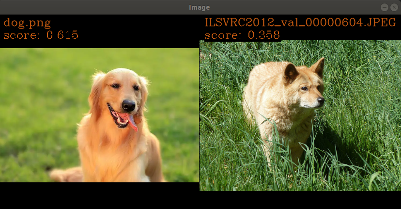

### 6.1 下载 one 模型及配置文件  
从 5.1 节所示百度网盘下载，模型路径在：  
CLIP 和 mobileSAM 的 one 模型在 oneNew model/one model 的同名路径下；  
CLIP 和 mobileSAM 的 onnx 模型在 oneNew model/onnx model 的同名路径下。
### 6.2 运行模型  
#### 6.2.1 运行 CLIP 模型:  
1、**配置运行信息**  
将 clip_img.one 和 clip_txt.one 模型的路径存放到 rt_cfgs/rt_CLIP.yml 中，并配置 img_folder_path 的路径为 /home/oneNew/imgs/src_img/。   
2、**执行推理程序**  
步骤 2 的流程和上述 5.2.1 节完全一致。只是需要将 rt_cfgs/rt_CLIP.yml 作为可执行程序 model_infer 的入参
```shell {.line-numbers}
cd /home/oneNew/build/example
./model_infer /home/oneNew/configs/rt_cfgs/rt_CLIP.yml
```
3. **输入 txt**  
在步骤 2 结束后，会有
```shell {.line-numbers}
please enter token（exit the program using 'exit'）>:
```  
提示，此时需要到 oneNew/tools/tokenizer/clip_model_tokenizer.py 中，将文本转为 token id，并键入此处。  
在 tokenizer.py 中，预设有文本 "This is a photo of a dog sitting on a green lawn"。将转换后的 token id 序列作为上述提示的输入。
enter 即可获取到与文本匹配的结果。  
4、**获取输出结果**  
如果在执行完上述步骤后，终端显示如下图所示，即表示适配成功。  


#### 6.2.2 运行 mobileSAM 模型:
1、**配置运行信息**  
将 mobile_sam_encoder.one 和 mobile_sam_decoder.one 模型的路径存放到 rt_cfgs/rt_mobileSAM.yml 中，并配置 input_data_path 的路径为 /home/oneNew/imgs/src_img/street.jpg。   
2、**执行推理程序**  
步骤 2 的流程和上述 5.2.1 节完全一致。只是需要将 rt_cfgs/rt_mobileSAM.yml 作为可执行程序 model_infer 的入参
```shell {.line-numbers}
cd /home/oneNew/build/example
./model_infer /home/oneNew/configs/rt_cfgs/rt_mobileSAM.yml
```  
3、**获取输出结果**  
如果在执行完上述步骤后，终端显示如下图所示，使用鼠标点击你感兴趣的区域（例如下图点击的是骑自行车的女士），可以发现该区域的图像被 mask 为粉红色。你可以任意点击图片任何位置。  


4、注意：  
你可以调整 rt_mobileSAM.yml 中的 sam_mask_level，从 0 ～ 3，分别会输出不同 size 的 mask


